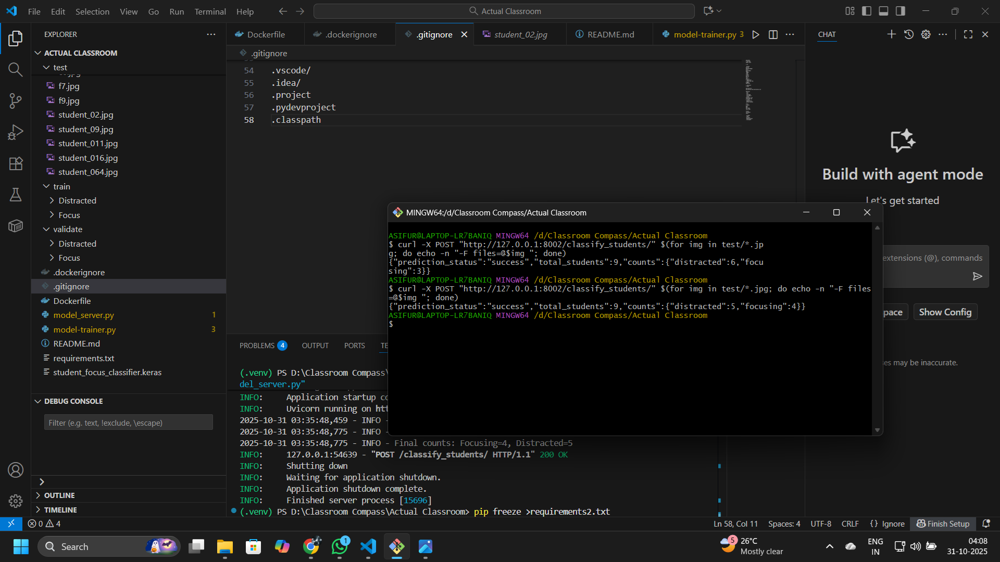
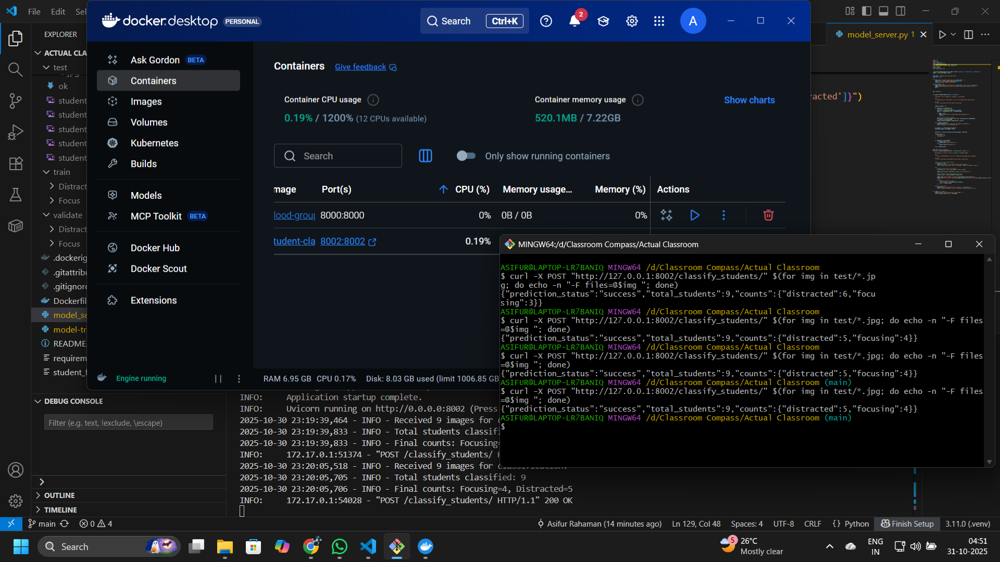

# Classroom Compass - Focus/Distraction Classifier

This repository contains the code for the **Focus/Distraction Classification Service**, a key microservice for the larger **Classroom Compass** project.

Classroom Compass is an AI-powered platform designed to provide real-time, non-intrusive feedback to teachers about student engagement. It helps teachers understand when a class is confused or disengaged without tracking individual students, allowing them to adjust their teaching style on the fly.

This specific service is responsible for the final classification step: determining if a student is "focused" or "distracted" based on a pre-processed image.

## Role in the Project Pipeline

This service does not operate in isolation. It is the second stage in a two-stage computer vision pipeline, as shown in the project architecture.

1.  **Stage 1: Segregation (External)**
    A separate model, the [Classroom-Person-Segregation-Model](https://github.com/asifur8282/Classroom-Person-Segregation-Model), first processes the main classroom camera feed. It performs object detection to find and crop each student into an individual image.

2.  **Stage 2: Classification (This Service)**
    These individual (segregated) student images are then sent in a batch to this FastAPI endpoint (`model_server.py`). This service's Convolutional Neural Network (CNN) classifies each image as `focusing` or `distracted`.

3.  **Output:**
    The service returns a JSON object with the final aggregated counts (e.g., `{"focusing": 15, "distracted": 3}`), which is then consumed by the main Classroom Compass dashboard.

## Tech Stack

  * **Python 3.11**: The core programming language.
  * **TensorFlow (Keras)**: For building and running the CNN model.
  * **FastAPI**: For serving the model as a high-performance, lightweight API.
  * **Uvicorn**: As the ASGI server for FastAPI.
  * **OpenCV-Python**: For image preprocessing.
  * **Docker**: For containerizing the entire application for consistent deployment.

## Key Files

  * `model_server.py`: The FastAPI application that loads the trained model and serves the API endpoint.
  * `student_focus_classifier.keras`: The **pre-trained Keras model file**.
  * `model-trainer.py`: Script to **optionally train your own model** if you provide a dataset.
  * `Dockerfile`: Instructions to build the production Docker container.
  * `requirements.txt`: A list of all required Python packages.

-----

## Getting Started: Two Options

You have two options for using this service:

### Option 1: Run the Pre-trained Model (Recommended)

This is the simplest path. The pre-trained `student_focus_classifier.keras` model is included in this repository. You can deploy and use the service immediately using Docker.

**Proceed to the [Docker Deployment](#getting-started-docker-deployment) section.**

### Option 2: Train Your Own Model

If you want to train the model on your own data, you can use the `model-trainer.py` script.

**1. Dataset Notice**
Due to privacy concerns, the original training, validation, and test datasets are not provided. The included model was trained on images of real people.

**2. Create Your Dataset**
You must provide your own dataset. The script expects the data to be in the following directory structure:

```
.
├── train/
│   ├── Distracted/
│   │   ├── image1.jpg
│   │   ├── image2.png
│   │   └── ...
│   └── Focus/
│       ├── image3.jpg
│       ├── image4.png
│       └── ...
│
└── validate/
    ├── Distracted/
    │   ├── image5.jpg
    │   └── ...
    └── Focus/
        ├── image6.jpg
        └── ...
```

**Dataset Structure Example:**

**3. Run the Training Script**
Once your `train/` and `validate/` directories are populated, install the dependencies from `requirements.txt` (ideally in a virtual environment) and run the trainer:

```bash
# First, setup a virtual environment (optional but recommended)
python -m venv venv
source venv/bin/activate  # On Windows: venv\Scripts\activate

# Install dependencies
pip install -r requirements.txt

# Run training
python model-trainer.py
```

This will overwrite the `student_focus_classifier.keras` file with your newly trained model. You can now proceed to the Docker deployment.

-----

## Getting Started (Docker Deployment)

This service is designed to be built and run as a Docker container. This process packages the `model_server.py` and the `.keras` model file.

### Prerequisites

  * [Docker Desktop](https://www.docker.com/products/docker-desktop/) must be installed and running.
  * [Git](https://git-scm.com/downloads) (for cloning the repository).
  * The `student_focus_classifier.keras` file must be present (either the included one or your own).

### Step 1: Clone the Repository

```bash
git clone <your-repository-url>
cd <your-repository-name>
```

### Step 2: Build the Docker Image

From the root directory, run the `docker build` command. This will create a local image named `student-classifier`.

```bash
docker build -t student-classifier .
```

### Step 3: Run the Docker Container

After the image is successfully built, run it. This command starts the container, launches the FastAPI server, and maps port `8002` on your local machine to port `8002` inside the container.

```bash
docker run -p 8002:8002 student-classifier
```

Your server is now running and ready to accept requests.

-----

## Usage & API Testing

Once the container is running, you can send `POST` requests to its endpoint. You will need to create your own `test` folder containing images for this step.

### Example: Testing with `curl`

The endpoint expects a `multipart/form-data` body containing one or more `files`.

**From Git Bash (or macOS/Linux):**
This one-liner will find all `.jpg` files in a `test/` directory and send them in a single request.

```bash
curl -X POST "http://127.0.0.1:8002/classify_students/" \
$(for img in test/*.jpg; do echo -n "-F files=@$img "; done)
```

**Example Usage (Git Bash):**

**From Windows CMD (Manual):**
You must specify each file manually.

```cmd
curl -X POST "http://127.0.0.1:8002/classify_students/" -F "files=@test\student_01.jpg" -F "files=@test\student_02.jpg"
```

### API Endpoint Reference

#### `POST /classify_students/`

  * **Description:** Classifies a batch of uploaded student images.
  * **Request Body:** `multipart/form-data`
  * **Form Fields:** `files` (can be provided multiple times)
  * **Success Response (200 OK):**
    ```json
    {
      "prediction_status": "success",
      "total_students": 9,
      "counts": {
        "distracted": 2,
        "focusing": 7
      }
    }
    ```
  * **Error Response (500 Internal Server Error):**
    ```json
    {
      "prediction_status": "error",
      "message": "Internal server error."
    }
    ```


## Visual Examples


### Usage Without Docker (Local Server)

You can run the server locally without Docker by running `python model_server.py`. The `curl` command remains the same.


### Usage With Docker (Recommended)

This shows the `docker run` command, the server logs, and the `curl` command in Git Bash all working together.
